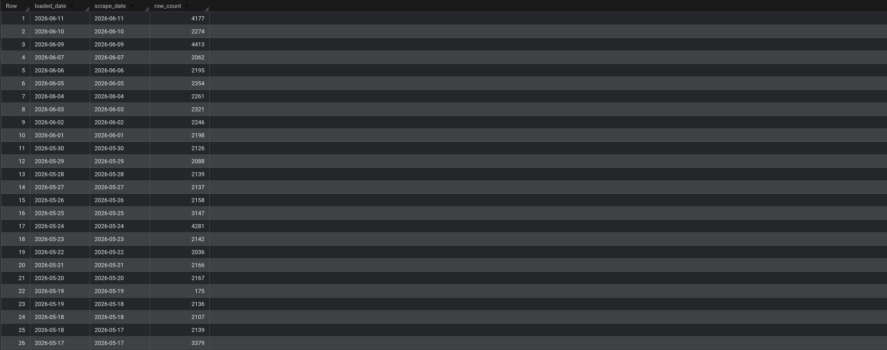
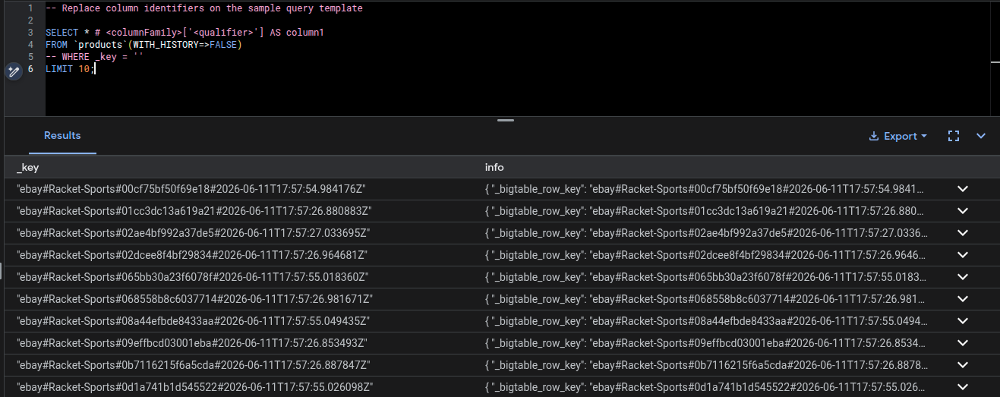
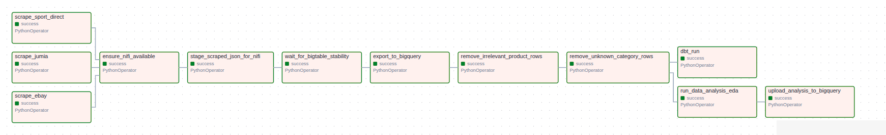
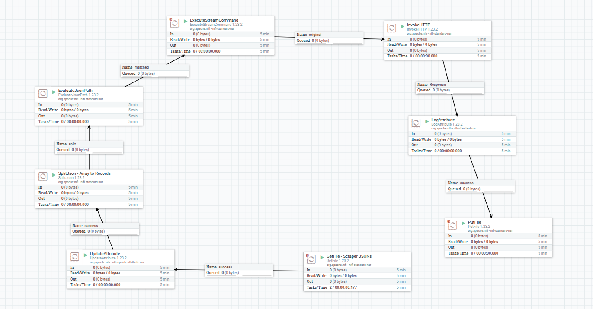

# Price Intelligence — A Sports-Nutrition Price Monitoring Platform

[](https://github.com/Oubay-S/price-intelligence/actions/workflows/ci.yml)

Academic group project, Data Engineering and Analytics, Pr Lotfi ELAACHAK, 2025–2026.

## Application demo

A short screen recording of the running application (catalog, product price
history, watchlist, and alerts):

<video src="images/demo.mp4" controls width="100%"></video>

[Watch the demo video](images/demo.mp4) if the player above does not load in your viewer.

---

The platform scrapes sports and nutrition products from three online
marketplaces, stores their full price history, runs the data through a cleaning
and modelling pipeline, and serves it to users through a web application with a
personal watchlist and price-drop alerts.

This README is the global report. It pulls together the work of the four team
members, each of whom owned one layer of the system and kept a detailed
write-up in their own folder. The per-layer documents are still there if you
want the deep version:

- `scrapers/DATA_ENGINEER_README.md` — ingestion and the data pipeline
- `data-analysis/README.md` — exploratory analysis and statistics
- `INFRA/rapport_dataops.MD` — orchestration, CI/CD, and cloud infrastructure
- `backend/README.md` — the FastAPI service
- `frontend/README.md` — the Angular application

---

## Team and responsibilities

| Role | Member | Owned layer | Working branch |
| --- | --- | --- | --- |
| Data Engineer | Aouichi Omar | Scrapers, Airflow, NiFi, Bigtable, BigQuery, dbt, Great Expectations | `data/engineer` |
| Data Analyst | EL Ghrib Assil | Notebooks, EDA, statistical tests, dashboard exports | `data-analysis` |
| DataOps / Cloud Engineer | EL Arabi Serghini Oubay | Docker, CI/CD, Terraform, security scanning | `infra-dataops` |
| Fullstack Developer | EL Arroud Mohamed Reda | FastAPI backend, Angular frontend, Nginx | `feature/fullstack` |

Each of us worked sports-nutrition pricing from a different angle, but the four
layers only mean something together. The sections below follow the data as it
moves through them, from a scraped product page to a chart in the browser.

---

## How we worked together

We split the repository by role and each person worked on their own branch.
The rule we agreed on early was simple: nobody pushes straight to the shared
branches. The flow looked like this.

```
data/engineer    ─┐
data-analysis    ─┤
infra-dataops    ─┼──►  develop  ──►  master
feature/fullstack ─┘   (integration)   (stable)
```

1. Everyone branched off `develop` into their role branch
   (`data/engineer`, `data-analysis`, `infra-dataops`, `feature/fullstack`).
2. We built and tested our part in isolation, so a broken scraper never blocked
   the frontend and an experimental notebook never touched the API.
3. When a piece was working, we opened a pull request into `develop`. The CI
   pipeline (described in the DataOps section) had to pass before the merge was
   allowed. That gate caught build breaks, leaked secrets, and failing tests
   before they reached anyone else.
4. Once `develop` held a coherent, working version of the whole stack, we merged
   it into `master`. `master` is the branch we treat as stable and demo-ready.

The branch-per-role setup mattered more than we expected. Most of us were
touching Python, but the work pulled in opposite directions. Keeping it
separated until CI signed off saved us from the usual end-of-project merge panic.

---

## System architecture

The platform runs as two layers on two isolated Docker networks. The data layer
handles scraping, orchestration, and storage. The application layer serves
users. The backend container sits on both networks because it is the one
component that needs to read product prices and serve API traffic at the same
time.

```
DATA SOURCES
  Jumia (MA)        Sport Direct (UK)        eBay (Global)
       |  Selenium         |  Selenium             |  Selenium + xvfb
       v                   v                       v
SCRAPERS (Python + Selenium)  ->  raw JSON per store/category
       |  Airflow stages JSON -> nifi_inbox/
       v
APACHE NIFI  ->  streams each record into Bigtable
       v
GOOGLE CLOUD BIGTABLE  (hot store, up to 100 price versions per product)
       |  bigtable_to_bigquery.py (via Airflow)
       v
GOOGLE BIGQUERY  (raw products)  ->  dbt:  stg -> int -> mart
       v
FastAPI  ->  Angular SPA   (behind an Nginx reverse proxy)
```

The whole thing comes up with one `docker-compose up`. Here is the full stack
running locally, every container green:


---

## Data engineering

**Owner: Aouichi Omar — branch `data/engineer`**

The job of this layer is to turn three messy retail websites into one clean,
queryable table of prices that grows every day.

### Scraping

Each marketplace has its own scraper built on Python and Selenium, driving a
headless Chrome through `webdriver-manager`. eBay needs an extra `xvfb` virtual
display to behave. The scrapers cover six sports categories (football, gym,
basketball, volleyball, combat-sports, and racket-sports) and write raw JSON per
category. Every record carries the same fields: name, current price, price before
discount, discount, rating, availability, product and image URLs, a free-text
features blob, sizes, the scrape timestamp, the store, and the category.

### Storage choice: Bigtable then BigQuery

We use two Google stores on purpose. Bigtable is the hot store. Its row key is
`{store}#{category}#{name-slug}#{uuid}` and the `info` column family keeps up to
100 versions per cell, so a single product row holds its whole price history. A
product whose price moves every day still lives under one key. That versioning is
the reason we chose Bigtable over a plain table; the price history is the product.

BigQuery is the analytical store. The export script reads every Bigtable row,
deduplicates against what is already in BigQuery using `_bigtable_row_key`, drops
irrelevant products, checks that the required fields are present, and appends the
new rows with load metadata. Because the load is append-only and deduplicated, we
can re-run it without creating duplicates. The screenshot below shows the row
count landing in BigQuery per scrape day, a few thousand new products on most
days.



The Bigtable row keys, the part that makes deduplication work, look like this:



### Orchestration with Airflow

One DAG, `price_intelligence_pipeline`, runs the whole thing daily. The three
scrapers run in parallel, then the pipeline stages the JSON for NiFi, waits for
Bigtable to settle, exports to BigQuery, cleans out junk and unknown categories,
and finally fans out into dbt and the analyst's notebooks. Here is a real run
with every task green:



### Real-time ingestion with NiFi

NiFi watches the `nifi_inbox/` folder and streams each staged file into Bigtable
through `nifi_to_bigtable.py`, tagging every record with an ingestion run id and
a staging timestamp. This is the streaming path that runs alongside the daily
batch. The NiFi flow canvas:



### Transformations with dbt

dbt turns the raw BigQuery table into models the rest of the team can trust:

- `stg_prices` cleans and types the raw data. Prices arrive as strings, so this
  is where they become numbers, timestamps get parsed, store names get
  standardised, and bad rows get filtered out.
- `int_price_daily` aggregates to one row per product per day.
- `mart_price_trends` is the final table the backend reads for its charts.

### Data quality

Cleaning happens in layers, not in one place. Airflow validates the JSON schema
before ingestion, and a pure-Python rule library (`product_quality.py`) filters
out products that were scraped by mistake, such as VR headsets and toothpaste
that slipped into a sports search. After export, a set of BigQuery cleanup
scripts catch whatever got through and re-classify products with a missing
category. As a final guard, we added a Great Expectations gate that validates the
raw rows before they reach BigQuery, so the warehouse stays clean at the door
rather than being scrubbed afterwards.

> **More detail:** the full data-engineering write-up — scraper internals, the
> Airflow DAG task by task, Bigtable row-key design, the export and dedup logic,
> and the data-quality rules — is in
> [`scrapers/DATA_ENGINEER_README.md`](scrapers/DATA_ENGINEER_README.md).

---

## Data analysis

**Owner: EL Ghrib Assil — branch `data-analysis`**

The analysis starts where storage ends. The official source is the BigQuery
table `price-intelligence-495411.price_intelligence.products`. Five notebooks run
in order: data understanding, cleaning, exploratory analysis, statistical tests,
and final insights. A pipeline script can replay them after each scrape and
regenerate the dashboard exports in one command.

### What the prices look like

eBay and Sport Direct sit at a higher median price than Jumia across almost every
category. Jumia is the budget platform in this dataset.


Breaking it down by both platform and category at once shows where the money is.
Volleyball gear on Sport Direct has the highest median in the whole matrix;
combat-sports and gym products tend to be the cheapest.


The full distributions, after cleaning, show how long the tails are. Most
products are cheap, but every platform carries a thin spread of expensive
outliers, and Jumia's outliers are the most extreme relative to its low median.


### Prices over time

We have roughly a month of daily scrapes. The median price per platform bounces
around but holds the same ranking, eBay and Sport Direct above Jumia, with a
spike in mid-May that the cleaning step later flattened.


### Statistical work

The exploratory plots raised obvious questions, so the later notebooks tested
them properly. The relationship between a product's rating and its price is weak
and noisy. Expensive products are not reliably better rated, and a large share of
products carry a zero rating because they simply have no reviews yet.


The Spearman correlations confirm it numerically. Price and discount have a
moderate negative correlation (−0.31): the cheaper products tend to be the ones
on sale. Rating barely correlates with anything.


We also fit an OLS regression to model price from store, category, rating, and
discount. The residual diagnostics below are the honest part of the story. The
residuals are roughly centred but heavy-tailed, and they fan out at higher fitted
values, which is the heteroscedasticity you would expect from price data with a
long right tail. In plain terms, the model explains the cheap bulk of the catalog
better than the expensive outliers.


The notebooks export their results as JSON files (KPIs, price by store, price by
category, time series, heatmap, top discounts, recommendations) that the frontend
reads directly, so the analyst's conclusions show up in the product without a
manual hand-off.

> **More detail:** notebook-by-notebook execution order, the statistical tests
> (ANOVA, Kruskal-Wallis, regression, confidence intervals), and the dashboard
> export contract are documented in
> [`data-analysis/README.md`](data-analysis/README.md).

---

## DataOps and cloud engineering

**Owner: EL Arabi Serghini Oubay — branch `infra-dataops`**

This layer's job was to make the other three reproducible, secure, and ready for
the cloud. The goal was that everyone else could commit code, push, and trust
that the platform still worked, without ever setting up infrastructure by hand.

### The Docker environment

The local environment is a `docker-compose.yml` that brings up more than ten
services across two networks. One decision shaped the rest: instead of running a
local Bigtable emulator, the local containers connect to a real Cloud Bigtable
instance. That makes the development environment a true hybrid, local compute and
cloud storage, and means the code we test locally is the code that runs against
the real database.

The two networks keep concerns apart. `price-intel-network` carries the heavy ETL
and orchestration traffic. `app-network` serves end users. The backend bridges
both. Nginx is the single entry point on port 80, routing `/api/*` to the backend
and everything else to the frontend.

### CI/CD: the merge gate

Every push and pull request runs through a GitHub Actions pipeline before it can
reach `develop`. It runs in parallel and covers a lot of ground: linting and type
checks, dbt model compilation, the frontend build, Python security scanning with
Bandit, secret detection with Gitleaks, dependency CVE auditing, Docker image
scanning with Trivy, and Terraform misconfiguration checks. The last stage builds
the images and runs the full stack inside the runner to confirm the services
actually talk to each other. Only if all of that passes does the merge gate go
green.


The secret-scanning stage earned its place quickly. Because we use a real GCP key
file locally, a single careless commit could have leaked production credentials.
The pipeline fails hard if it ever sees one.

### Infrastructure as Code

To move from Docker to a production Google Cloud setup, the infrastructure is
written as modular Terraform. The mapping aims for a managed, low-operations
model: Bigtable stays as is, `postgres-app` becomes Cloud SQL, Airflow becomes
Cloud Composer, the backend becomes Cloud Run, and the frontend goes behind Cloud
Storage with a CDN and a load balancer. The Cloud Run service account is scoped to
read Bigtable and connect to Cloud SQL and nothing more. Separate dev and prod
variable files keep the dev environment cheap and the prod environment highly
available.

> **More detail:** the full DataOps mission report — the service-by-service
> Docker breakdown, the nine-stage CI/CD pipeline, and the Terraform module
> layout with the cloud mapping — is in
> [`INFRA/rapport_dataops.MD`](INFRA/rapport_dataops.MD).

---

## Fullstack: backend and frontend

**Owner: EL Arroud Mohamed Reda — branch `feature/fullstack`**

This is the layer users actually see. It reads the cleaned data the pipeline
produced and turns it into a product.

### Backend (FastAPI)

The backend is a FastAPI service that deliberately straddles two databases.
Postgres holds user-facing state: accounts, sessions, refresh tokens, the
watchlist, and price alerts. BigQuery holds the product catalog and price
history. The split is a rule, not an accident. Per-user data goes to Postgres,
product data comes from BigQuery, and the two only join in the service layer. The
link between a watchlist row and a product is intentionally not a foreign key,
because the product lives in a different database entirely.

The service exposes the expected surface: authentication with email verification
and password reset, product listing and search, price history and comparison, a
per-user watchlist, and brand and product statistics. One internal endpoint,
`/internal/price-event`, is the seam where the data and application layers meet.
NiFi posts a price event, and the backend invalidates its caches, broadcasts the
change over WebSocket to anyone watching live, checks every watchlist threshold,
and emails users who are offline. It is gated by an internal key and never
exposed publicly.

Connections use a psycopg2 pool directly, with no ORM. Schema changes after the
baseline go through Alembic, so the four of us could evolve the database without
wiping each other's local data.

### Frontend (Angular)

The frontend is an Angular single-page app built with standalone components and
signals, with `OnPush` change detection throughout. Every route is lazy-loaded.
Users can browse the catalog, open a product to see its price chart, compare
products side by side, manage a watchlist with target prices, and view the
analyst's market dashboard, which is exactly the JSON the analysis notebooks
exported.

Auth state lives in signals and survives a hard refresh through an app
initializer, so a logged-in user stays logged in. Two HTTP interceptors handle
the boring but critical parts: one attaches the bearer token and silently
refreshes it on a 401, the other catches errors and shows a toast. Every data
page renders the same four states (loading, error, empty, and data) so the UI
behaves predictably no matter what the backend returns.

In production the frontend is built to a static bundle and served by Nginx, which
also proxies the API and WebSocket traffic, so a single container is a working
entry point on its own.

> **More detail:** the backend API contract, auth flow, migrations, and the
> two-database split are in [`backend/README.md`](backend/README.md); the Angular
> architecture, routes, interceptors, and build setup are in
> [`frontend/README.md`](frontend/README.md).

---

## Running the stack

Everything runs through Docker Compose from the repository root.

```bash
docker-compose up -d --build      # bring up the whole platform
docker-compose ps                 # check every service is healthy
docker-compose logs -f <service>  # follow one service
docker-compose down               # stop, keep the data
```

Once it is up:

| URL | What |
| --- | --- |
| `http://localhost/` | The app through the Nginx reverse proxy |
| `http://localhost:4200/` | Angular app, direct |
| `http://localhost:8000/docs` | Backend API docs (Swagger) |
| `http://localhost:8080/` | Airflow |
| `https://localhost:8443/nifi` | NiFi |

To run the daily pipeline by hand:

```bash
docker-compose exec airflow-scheduler \
  airflow dags trigger price_intelligence_pipeline
```

And to run the dbt models on their own:

```bash
docker-compose run --rm dbt dbt run
docker-compose run --rm dbt dbt test
```

---

## Closing notes

The four layers were built separately and merged through `develop` into
`master`, but the point of the project was always the seam between them. A price
scraped from Jumia at night becomes a versioned Bigtable row, then a cleaned
BigQuery record, then a number in a statistical test, then a chart in someone's
browser the next morning. Keeping those handoffs honest, with clean data, a CI
gate, and a shared database contract, is most of what made the separate pieces
add up to one platform.
