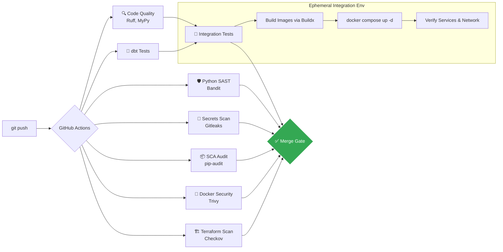

# 🚀 Architecting Data at Scale: Price Intelligence
**Comprehensive DataOps & Cloud Engineering Mission Report**

---

> [!NOTE]
> **Mission Context**
> For the **Price Intelligence E-Commerce Platform (2025-2026)**, I operated as the **DataOps & Cloud Engineer**. My primary mission was to bridge the gap between local data engineering scripts and a production-grade, highly available cloud product. This comprehensive report details my work orchestrating the multi-container local environment, designing the Google Cloud Platform (GCP) architecture via Terraform, and building a secure, automated CI/CD Software Factory.

---

## 🐳 1. Hybrid-Cloud Orchestration: The Docker Ecosystem

To ensure a seamless Developer Experience (DX) and an exact mirror of our future cloud infrastructure, I engineered a complex local environment using `docker-compose.yml`. A major architectural decision I made was to **abandon local emulators for Bigtable**. Instead, our local Docker containers connect **directly to a real Google Cloud Bigtable instance**, creating a true **Hybrid-Cloud** development environment. 

This orchestrates **10+ distinct services** across **2 isolated Docker networks**, securely bridging local compute with cloud storage.

### 🕸️ Network Architecture

The environment strictly separates concerns using two Docker bridge networks:
1. `price-intel-network`: The **Data Layer**, handling heavy ETL workloads, scraping, and Airflow orchestration.
2. `app-network`: The **Application Layer**, serving end-users, handling authentication, and serving the API.

*The `backend` container acts as a bridge, connecting to both local networks and authenticating externally to GCP.*

### 📦 Services Breakdown

#### The Data Layer (`price-intel-network`)
| Service | Image/Tech | Internal Port | Host Port | Description & Connectivity |
|---------|------------|---------------|-----------|----------------------------|
| **`postgres` (Airflow)**| PostgreSQL 15 | `5432` | `5433` | The metadata database for Apache Airflow. I mapped it to host port `5433` to prevent conflicts with the application's database or local Postgres installations. |
| **`airflow-init`** | Airflow | - | - | Ephemeral container. Runs `airflow db migrate` and creates the `admin` user, preventing developers from doing manual setup. |
| **`airflow-webserver`** | Airflow | `8080` | `8080` | The Airflow UI. Developers access it via `http://localhost:8080` to monitor the daily scraping DAGs. Connects to `postgres` for metadata. |
| **`airflow-scheduler`** | Airflow | - | - | The heart of Airflow. It triggers the Selenium/BeautifulSoup scrapers (Jumia, SportsDirect, eBay) and pushes data directly to **GCP Cloud Bigtable** via service account keys. |
| **`nifi`** | Apache NiFi | `8443` | `8443` | Used for real-time streaming ingestion. Connects securely to **Cloud Bigtable** to pipe streaming metrics. |
| **`dbt`** | dbt-bigquery | - | - | Transformation layer (run on-demand) targeting BigQuery for analytical modeling. |

#### The Application Layer (`app-network`)
| Service | Image/Tech | Internal Port | Host Port | Description & Connectivity |
|---------|------------|---------------|-----------|----------------------------|
| **`postgres-app`** | PostgreSQL 15 | `5432` | `5432` | The transactional database serving the frontend. It stores Users, Watchlists, and Alert thresholds. Initialized automatically via SQL scripts mounted in `/docker-entrypoint-initdb.d`. |
| **`redis`** | Redis 7 | `6379` | `6379` | In-memory cache and session store to accelerate API responses and handle WebSockets. |
| **`backend`** | FastAPI (Python)| `8000` | `8000` | The core API. **Crucially, it is attached to BOTH networks**. It connects to `postgres-app` and `redis` (app-network) for user management, and securely queries **GCP Cloud Bigtable** to fetch the actual product prices. |
| **`frontend`** | Angular 17 | `80` | `4200` | The Single Page Application (SPA). Built and served by a lightweight server internally. |
| **`nginx`** | NGINX 1.25 | `80` | `80` | The **Reverse Proxy** and single entry point. It receives all traffic on `http://localhost:80`. It routes `/api/*` to `backend:8000`, and everything else (`/*`) to `frontend:80`. |

#### The Monitoring Layer (`app-network` & `price-intel-network`)
| Service | Image/Tech | Internal Port | Host Port | Description & Connectivity |
|---------|------------|---------------|-----------|----------------------------|
| **`prometheus`** | Prometheus v2.53.1 | `9090` | `9090` | Acts as the central time-series database. Scrapes metrics from `backend` (FastAPI) and `cadvisor` every 15 seconds. |
| **`grafana`** | Grafana 11.1.0 | `3000` | `3000` | Provides interactive dashboards. Connects to `prometheus` to visualize performance metrics. |
| **`cadvisor`** | cAdvisor v0.49.1 | `8080` | `8082` | Deployed to collect real-time container resource metrics (CPU, RAM, Network I/O) from the Docker daemon. |

---

## ⚙️ 2. The Software Factory: CI/CD Pipeline

To ensure zero-defect deployments, I built a highly parallelized 9-stage **GitHub Actions Workflow** (`ci.yml`). Every single push or pull request goes through this gauntlet.

### 🔍 Step-by-Step Job Breakdown & Justification

1. **`lint` (Code Quality & Formatting)**
   - **What it does:** Runs `ruff` for ultra-fast Python linting and `mypy` for static type checking.
   - **Why it was added:** Ensures the codebase remains readable, strictly typed, and uniform across multiple developers, drastically reducing runtime `TypeError`s.

2. **`dbt-validate` & `pipeline-tests`**
   - **What it does:** Compiles dbt models to catch SQL syntax errors and runs `pytest` for the scraping algorithms.
   - **Why it was added:** Validates data engineering logic before integration.

3. **`frontend-quality`**
   - **What it does:** Runs Angular's Node.js build process.
   - **Why it was added:** Ensures UI code compiles without errors and dependency clashes.

4. **`sast` (Static Application Security Testing)**
   - **What it does:** Uses `Bandit` to scan the Python code.
   - **Why it was added:** Detects hardcoded passwords, SQL injection vulnerabilities, and weak cryptographic hashes before they are merged.

5. **`secrets-scan`**
   - **What it does:** Uses `TruffleHog` and `Gitleaks` to scan the entire git commit history.
   - **Why it was added:** If a developer accidentally commits a GCP JSON key (which is critical since we use real GCP Bigtable locally), this job catches it immediately and fails the pipeline, preventing massive security breaches.

6. **`dependency-scan` (SCA)**
   - **What it does:** Uses `pip-audit`.
   - **Why it was added:** Cross-references our `requirements.txt` against known CVE (Common Vulnerabilities and Exposures) databases to ensure we aren't shipping exploited libraries.

7. **`docker-security`**
   - **What it does:** Uses `Trivy` to scan the generated Docker images (Airflow, FastAPI).
   - **Why it was added:** Detects vulnerabilities at the Operating System level (e.g., outdated Debian packages inside the container).

8. **`iac-scan` (Infrastructure as Code Security)**
   - **What it does:** Uses `Checkov` to scan our Terraform files, and `Hadolint` for Dockerfiles.
   - **Why it was added:** Checks for cloud misconfigurations, such as accidentally leaving a GCS bucket public, or opening firewall ports (0.0.0.0/0) unnecessarily.

9. **`integration-tests` (The Ultimate Gate)**
   - **What it does:** Uses Docker Buildx to dynamically build the images, then runs `docker compose up -d` right inside the GitHub Runner. It waits for the healthchecks and curls the API endpoints.
   - **Why it was added:** Unit tests are not enough. We must ensure that FastAPI can successfully talk to Postgres, and that Nginx correctly routes traffic. If the containers crash on boot, the CI fails.

---

## 🏗️ 3. Cloud Architecture & Infrastructure as Code (Terraform)

To transition from the local Docker environment to a production Google Cloud Platform (GCP) environment, I wrote a 100% modular Infrastructure as Code (IaC) setup using **Terraform**.

### A True Hybrid-Cloud Mapping
Unlike standard setups, our local environment relies on the actual Cloud Bigtable instance. The rest of the architecture was mapped to fully managed cloud services to achieve a "NoOps" operational model:
- **Cloud Bigtable** (Massive NoSQL throughput for prices, shared between Dev and Prod securely).
- **`postgres-app`** ➔ **Cloud SQL for PostgreSQL** (Highly Available transactional DB).
- **`airflow-*`** ➔ **Cloud Composer 2** (Fully managed Apache Airflow cluster).
- **`backend`** ➔ **Cloud Run** (Serverless execution, scaling from zero to thousands of containers).
- **`frontend` / `nginx`** ➔ **Cloud Storage (GCS) + Cloud CDN + Global Load Balancer** (Serverless edge delivery).
- **`prometheus` / `grafana` / `cadvisor`** ➔ **Google Cloud Monitoring / Cloud Logging / Managed Service for Prometheus** (Serverless cloud observability and dashboarding).

### Terraform Modularity & Security
The code (`infra/terraform/`) is split into 9 logical modules (networking, iam, bigtable, sql, run, etc.).
- **State Management:** The `.tfstate` is stored remotely and securely in a GCS bucket (`backend.tf`) with locking enabled.
- **Least Privilege IAM:** The Cloud Run backend gets a Service Account that *only* has `roles/bigtable.reader` and `roles/cloudsql.client`. It cannot delete tables or alter infrastructure.
- **Environment Parity:** Created `dev.tfvars` (using cheap `db-f1-micro` instances and HDD storage) and `prod.tfvars` (using SSDs, Multi-AZ High Availability, and auto-scaling) to drastically optimize cloud costs.

---

## 📊 4. Observability & Monitoring

To guarantee system reliability and provide actionable insights into application performance, I engineered a complete local monitoring stack:

- **Prometheus**: Acts as the central time-series database, scraping metrics from our services every 15 seconds.
- **Grafana**: Provides interactive dashboards. I provisioned the `prometheus-fastapi-instrumentator` dashboard to track FastAPI's HTTP requests, error rates (4xx/5xx), and endpoint latencies.
- **cAdvisor**: Deployed to collect real-time container resource metrics (CPU, RAM, Network I/O). The native web interface allows for deep hardware-level inspection of the entire Docker stack.

This observability layer ensures that we don't just know *if* the platform is running, but exactly *how well* it is performing.

---

> [!IMPORTANT]
> **Final Impact**
> As DataOps, I successfully abstracted the complexity of infrastructure away from the Data Engineers and Web Developers. They now commit code locally, push to GitHub, and the entire platform is automatically verified for security, quality, and integration before being eligible for cloud deployment. With the addition of full-stack observability, the project is now truly enterprise-ready.